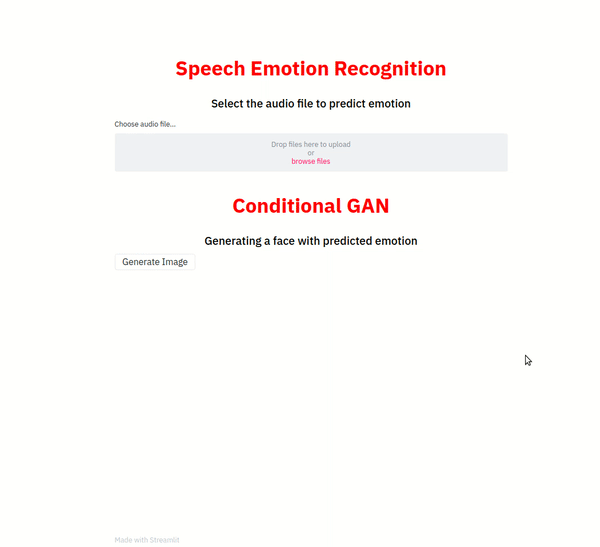
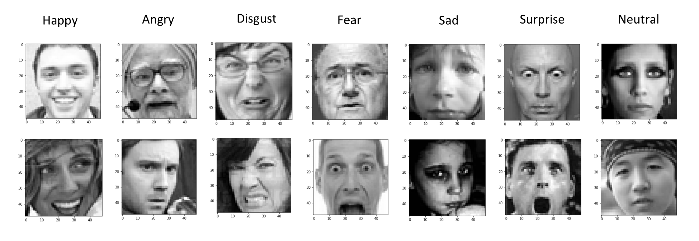
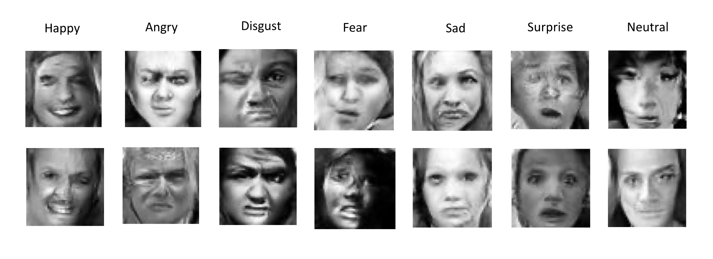

# Speech Emotion based face generation using Condition GANs
Generating human faces through conditional GANs which are conditioned on emotions identified from a human speech using SER (Speech Emotion Recognition)

An image showing the overall pipeline


Below is a short demo of the web app showing generation of human faces based on emotion identified from human speech.


## Results

Training samples


Generated samples

 
<br/>

## Getting Started

### Prerequisites

<br/>

### Directory Structure
> 

    Project
    
    ├── speech_emotion_recognition
    │   ├── code
    │   │   ├── train_ser.py
    │   │   ├── test_ser.py
    │   ├── data
    │   ├── pretrained_weights
    
    ├── conditional_gan
    │   ├── code
    │   │   ├── train_cgan.py
    │   │   ├── test_cgan.py
    │   ├── data
    │   ├── pretrained_weights
    
    ├── streamlit_webapp

### Data
For SER : 
<br/>
For GANs : 
<br/>

### Model Trainining 

To train both the models separately, run commands below. 

For SER:
```bash
$ python train_ser.py
```

For cGAN:
```bash
$ python train_cgan.py
```
<br>

### Prediction

<br/>

## References

<br/>

